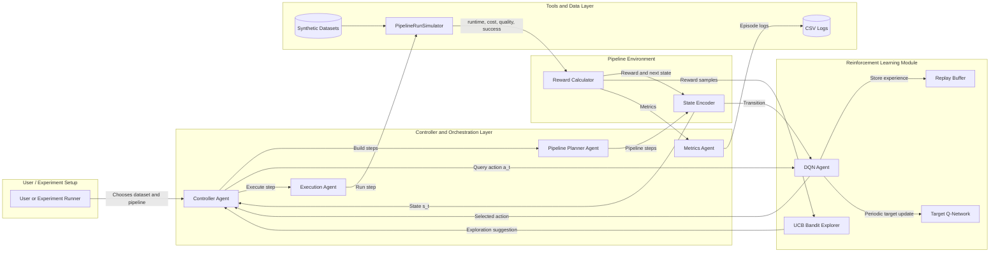

# 🚀 DataFlowRL  
### Reinforcement Learning for Data Pipeline Optimization  
**MS in Information Systems – Agentic AI Systems Final Project**


---

## 🧠 Overview

**DataFlowRL** is an agentic AI system that uses **Reinforcement Learning (RL)** to optimize data pipeline execution.  
Instead of manually picking tools (e.g., Pandas, Spark, DuckDB) and configurations (low/balanced/high resources), an RL agent learns—through experience—which combinations minimize runtime and cost while maintaining data quality.

This project integrates:

- **DQN (Deep Q-Network)** for value-based policy learning  
- **UCB Bandit Explorer** for structured exploration  
- **Agentic orchestration** (Controller Agent, Planner Agent, Execution Agent)  
- **Custom Pipeline Simulator**  
- **Multi-dataset, multi-pipeline experiments**  
- **Full analysis, plots, and results**

The system is designed for professional-grade evaluation and applies RL research concepts to a real-world data engineering scenario.

---

## 🌟 Key Features

### ✔ Reinforcement Learning  
- Deep Q-Network (PyTorch)  
- Experience Replay + Target Network  
- Hybrid exploration: DQN ε-greedy + UCB Bandit  

### ✔ Agentic Orchestration  
- Controller Agent coordinates the entire episode loop  
- Specialized agents for planning, execution, and logging  
- Custom tool: `PipelineRunSimulator`

### ✔ Simulated Data Environment  
Simulates:
- Runtime  
- Cost  
- Quality  
- Failure probability  
for each (tool, config, step type, complexity, dataset size) combination.

### ✔ Multi-Scenario Experiments  
- 3 dataset scales (10k, 100k, 1M rows)  
- 3 pipeline structures (A, B, C)  
- 40 RL training episodes, 20 eval, 20 baseline episodes  
- Automatic CSV generation + visualizations

---

## 🏗 System Architecture




## 📂 Project Structure
```
DataFlowRL/
│
├── src/
│   ├── controller/
│   │   └── controller.py
│   ├── rl/
│   │   ├── dqn_agent.py
│   │   ├── bandit.py
│   │   └── replay_buffer.py
│   ├── env/
│   │   └── pipeline_env.py
│   ├── tools/
│   │   └── pipeline_simulator.py
│   ├── datasets.py
│   ├── pipelines.py
│   ├── run_experiments.py
│   ├── plot_experiments.py
│   ├── analysis_full.py
│   └── main.py
│
├── experiments/
│   ├── train_*.csv
│   ├── baseline_*.csv
│   ├── eval_*.csv
│   ├── metrics_comparison_*.png
│   ├── train_rewards_*.png
│   ├── summary_all_scenarios.csv
│   ├── summary_all_scenarios_with_deltas.csv
│   └── percentage_improvements.csv
│
├── README.md
└── requirements.txt
```

## 🔧 Installation
```bash
# Clone the repository
git clone https://github.com/your-username/DataFlowRL.git
cd DataFlowRL

# Create virtual environment
python3 -m venv venv
source venv/bin/activate  # On Windows: venv\Scripts\activate

# Install dependencies
pip install -r requirements.txt
```

## ▶️ Running the Project

### 1. Run a Single End-to-End Pipeline
```bash
python -m src.main
```

### 2. Run Full Experiments (All Datasets × Pipelines)
```bash
python -m src.run_experiments
```

This will generate CSV logs for:
- Baseline performance metrics
- Training progress and rewards
- Evaluation results

### 3. Generate Plots
```bash
python -m src.plot_experiments
```

Outputs include:
- Reward curves over training episodes
- Baseline vs RL metric comparisons
- Cross-scenario summary CSVs

### 4. Compute Improvements (Statistics for Report)
```bash
python -m src.analysis_full
```

Generates:
- Raw performance deltas
- Percentage improvements
- Final summary tables
- Ready-made interpretation sentences

## 📊 Results (Sample)

- Runtime: RL is faster by about **15.40%** on average.
- Cost: RL is cheaper by about **6.87%** on average.
- Quality: RL changes quality by about **-0.66** percentage points on average.

- **Learning curves show clear improvement over training episodes**
- **RL consistently outperforms the heuristic baseline**


## 🧪 Visualizations

Inside the `/experiments/` directory:

| File Pattern | Description |
|--------------|-------------|
| `metrics_comparison_*.png` | Baseline vs RL performance comparisons |
| `train_rewards_*.png` | Learning curves during training |
| `summary_all_scenarios.csv` | Consolidated results across all experiments |
| `percentage_improvements.csv` | Statistical analysis of improvements |


## 🛠 Technologies Used

- **Python 3.10**
- **PyTorch** - Deep learning framework for DQN
- **NumPy, Pandas** - Data manipulation and analysis
- **Matplotlib** - Visualization
- **Reinforcement Learning** - DQN + UCB Bandit algorithms
- **Agentic Design Patterns** - Modular agent architecture
- **Custom Simulation Environment** - Pipeline execution simulator

## 🚀 Future Improvements

- [ ] DAG-based pipeline structures
- [ ] PPO/SAC for continuous resource allocation
- [ ] Real cluster log integration
- [ ] Multi-agent RL (per-step optimization)
- [ ] Transfer learning across data workloads

## 📜 License

MIT License © 2025

---

**Note**: This project demonstrates the application of reinforcement learning to optimize data pipeline execution, achieving significant improvements in runtime and cost while maintaining quality standards.
